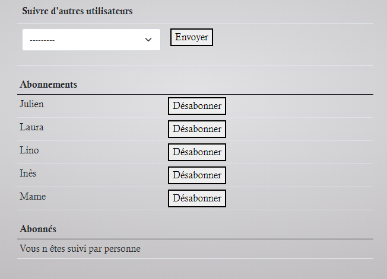

# P9_couignoux_julien

***

## Sommaire

* [I. Project Introduction](#chapter1)
    * [Application description](#section1_1)
* [II. Project install](#chapter2)
    * [Technologies Used](#section2_1)
    * [Usage](#section2_2)
    * [Note](#section2_3)
* [III. Application usage](#chapter3)
* [IV. DataBase](#chapter4)
    * [Default password](#section4_1)
    * [Super-User](#section4_2)
    * [Users](#section4_3)
* [V. Flake8 report](#chapter5)

***

## I. Project Introduction 

### Application description 
LITReview is an application to consulte or ask for reviews about books.  
Create your own community and follow it.

***
## II. Project installation 

### Technologies Used 
* Python3  
* Django4  
* Pillow  
* Bootstrap5

### Usage 
* Install python 3: https://www.python.org/downloads/
* Create and activate a virtual env: https://docs.python.org/3/library/venv.html
* Install requirements: pip install -r requirements.txt
* Clone the git project: git clone git@github.com:jcouignoux/P9_couignoux_julien.git
* python django_web_app/manage.py makemigrations
* python django_web_app/manage.py migrate
* python django_web_app/manage.py runserver
* In your web browser enter the address : http://localhost:8000 or http://127.0.0.1:8000/

### Note 
The Secret_Key required for the execution and debugging of project is not removed from the project code. So you can use the project as your college mini-project or by using the project code you can build your own project.
***
## III. Application usage 
* You have to signup and/or login to enter in the community and have access to the site.

* You can follow other community users to see their tickets or reviews.

* See the posts of your following community.  
* Create or ask for a review.

* See your own posts to modify or delete them.

***
## IV. DataBase 
A default database with fake users can be used to test the application.
For a database from scratch, you have to create :
* a superuser: python manage.py createsuperuser
* the community group via the admin interface.
    * Click on the Add button in line Groupes.
    
    * Enter the name (case sensitive) and Save.
    

### Default password 
For each users or superusers, default password is ***passwOrd2022***

### Super-User 
Superuser is the user Admin.
Connect to http://localhost:8000/admin to access the administration site.

### Users 
Inès, Julien, Laura, Lino or Mame make our community.

***
## V. Flake8 report 
Clean Flake8 report in flake-report/index.html